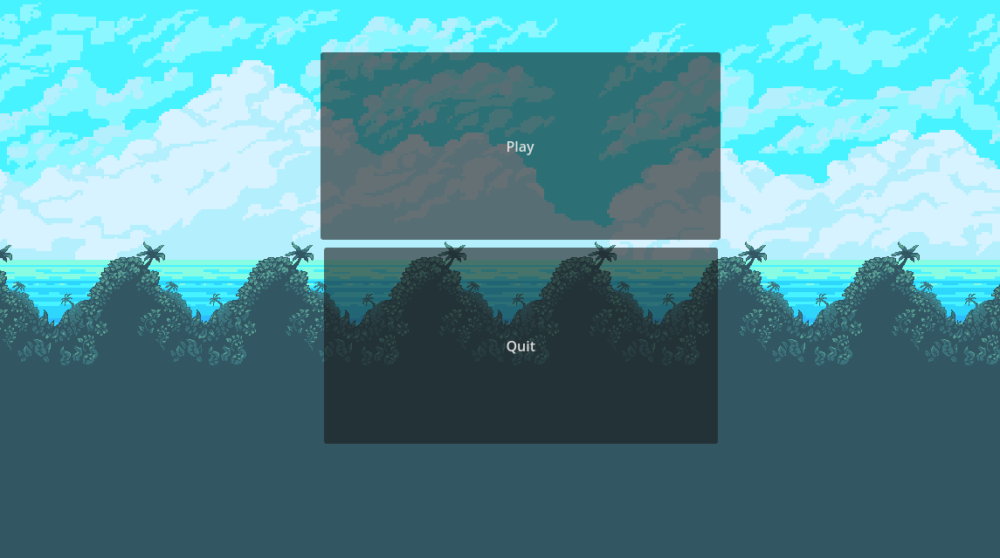
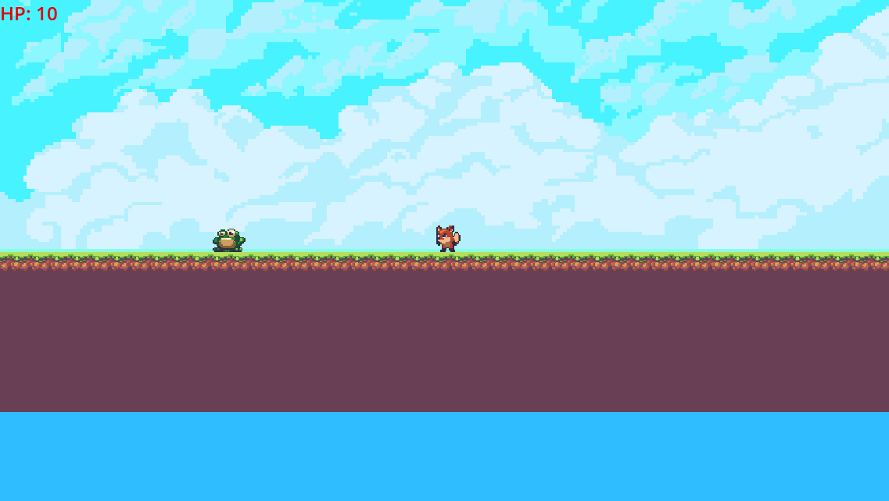

# PlatformGame
Platform game in Godot

When you play the game you should get this loading screen:

When you play the game you play as the fox. The enemy is the frog 

you can see the health in the top left